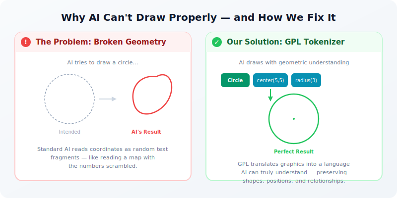
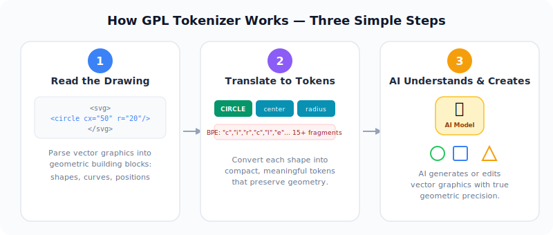
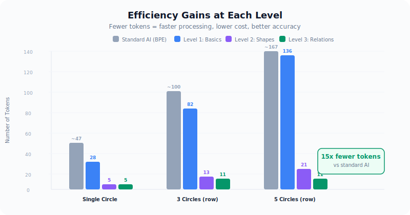
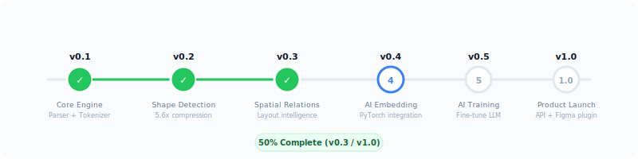

# GPL Tokenizer

**AI에게 도형과 그림을 진짜로 이해시키는 기술.**

  <a href="./README.md">English</a>

---

## 문제

오늘날의 AI 모델(ChatGPT, Claude 등)은 텍스트를 이해하고 생성하는 데 놀라운 성능을 보여줍니다. 하지만 벡터 그래픽 — 모든 앱, 웹사이트, 디자인 도구에서 사용하는 선명하고 확대 가능한 이미지 — 을 다루면 일관되게 실패합니다. 원은 찌그러지고, 사각형은 닫히지 않고, 좌표는 그냥... 틀립니다.

왜일까요? 현재 AI는 그래픽 코드를 영어 텍스트와 똑같은 방식으로 읽기 때문입니다 — 한 글자씩 잘라서. `150.5`라는 좌표는 `"1"`, `"50"`, `"."`, `"5"` 같은 의미 없는 조각으로 쪼개집니다. AI는 이 조각들이 *공간 위의 한 점*을 나타낸다는 것을 전혀 알지 못합니다. 지도의 글자를 한 자씩 읽으면서 길을 찾으려는 것과 같습니다.

  

## 해결책

GPL Tokenizer는 벡터 그래픽과 AI 모델 사이에 놓이는 **기하학 인식 번역 레이어**입니다. AI가 원시 코드를 글자 단위로 읽는 대신, 먼저 그래픽을 기하학적 이해에 최적화된 언어로 번역합니다.

원은 더 이상 28개의 텍스트 조각이 아닙니다 — 중심점과 반지름을 가진 하나의 "원" 토큰입니다. 동일한 버튼 5개가 나란히 있다면 167개의 텍스트 조각이 아닌, 버튼 하나 정의와 "등간격으로 4번 반복"입니다. AI는 흩어진 숫자가 아니라 도형, 위치, 공간 관계를 봅니다.

  

## 핵심 성과

3단계 압축을 구축했으며, 각 단계가 새로운 기하학적 지능을 추가합니다:

**Level 1 — 기본 기하학.** 각 그리기 명령(선, 곡선, 호)이 수학적 속성(위치, 곡률, 매끄러움)을 보존하는 구조화된 토큰으로 변환됩니다. 이것만으로도 표준 텍스트 토큰화 대비 2-3배 효율적입니다.

**Level 2 — 도형 인식.** 시스템이 자동으로 원, 사각형, 타원 같은 일반적인 도형을 감지하여 단일 토큰으로 압축합니다. Level 1에서 28개 토큰이 필요했던 원이 단 5개 토큰이 됩니다. 정보 손실 없이 **5.6배 압축**.

**Level 3 — 공간 지능.** 여러 요소가 패턴을 공유할 때(일렬 정렬, 등간격, 대칭) 이 관계를 포착합니다. 동일한 원 5개가 나란히? 각각 따로 기술하는 대신(21 토큰) "원 하나, 이 간격으로 4번 반복"이라고 합니다(11 토큰). 표준 AI 대비 **최대 15배 적은 토큰**.

  

AI가 처리해야 할 토큰이 적을수록 더 빠르게 실행되고, 비용이 줄고, 더 정확하게 그립니다. 이것은 단순한 최적화가 아닙니다 — AI가 시각적 콘텐츠를 이해하는 방식의 근본적인 전환입니다.

## 기술 구조

토크나이저 파이프라인은 네 가지 주요 단계로 구성됩니다:

**파싱(Parsing)** — 모든 SVG 파일을 읽고 구조화된 기하 명령으로 분해합니다 — 직선, 곡선, 호의 차이를 이해합니다.

**분석(Analysis)** — 각 조각을 검사합니다: 이 세그먼트의 곡률은? 다음 세그먼트와 매끄럽게 연결되는가? 이것은 사실 4개의 곡선으로 그려진 원인가? 이 도형들은 정렬되어 있거나 대칭인가?

**토큰화(Tokenization)** — 모든 것을 3단계에 걸쳐 간결하고 의미 있는 토큰으로 변환합니다 — 개별 명령(L1)에서 인식된 도형(L2), 공간 패턴(L3)까지.

**복원(Reconstruction)** — 과정을 완벽하게 역전합니다: 토큰이 다시 유효한 SVG 그래픽이 됩니다. 이 왕복 충실도는 47개의 자동화 테스트로 검증됩니다.

## 로드맵

  

- [x] **v0.1** — 코어 엔진: 파서, 기하 분석기, 토크나이저, 복원
- [x] **v0.2** — 도형 인식: 원, 사각형을 단일 토큰으로 압축
- [x] **v0.3** — 공간 지능: 정렬, 대칭, 간격 패턴 인식
- [ ] **v0.4** — AI 임베딩 레이어: 토큰을 신경망에 연결 (PyTorch)
- [ ] **v0.5** — AI 학습 파이프라인: SVG 생성을 위한 언어 모델 파인튜닝
- [ ] **v1.0** — 제품 출시: API 서비스 + Figma 디자인 도구 플러그인

## 왜 중요한가

벡터 그래픽은 어디에나 있습니다 — 앱 아이콘, 로고, UI 컴포넌트, 일러스트, 데이터 시각화, 지도. 글로벌 디자인 도구 시장은 130억 달러 이상으로 성장 중입니다. 그런데 AI는 아직 벡터 콘텐츠를 안정적으로 생성하거나 편집하지 못합니다.

GPL Tokenizer는 근본적인 병목을 해결합니다: AI 모델에게 2D 기하학의 네이티브 이해력을 부여하는 것. 이를 통해 AI 기반 디자인 생성, 자동 아이콘 생성, 지능형 SVG 편집, 그리고 실제로 정확한 결과를 내는 디자인-코드 워크플로가 가능해집니다.

## 기술 기반

기하학적 토큰화 분야의 학술 연구에 기반:

- **HiVG** (Xing et al.) — 계층적 SVG 토큰화
- **StrokeNUWA** (Tang et al.) — 벡터 합성을 위한 스트로크 토큰화
- **LLM4SVG** (Xing et al.) — SVG를 위한 언어 모델 강화
- **VectorGym** (Rodriguez et al.) — SVG 멀티태스크 벤치마크

## 라이선스

이 프로젝트는 독점 소프트웨어입니다. 모든 권리 보유.

---

*AI와 비주얼 디자인 사이의 다리를 만듭니다.*
