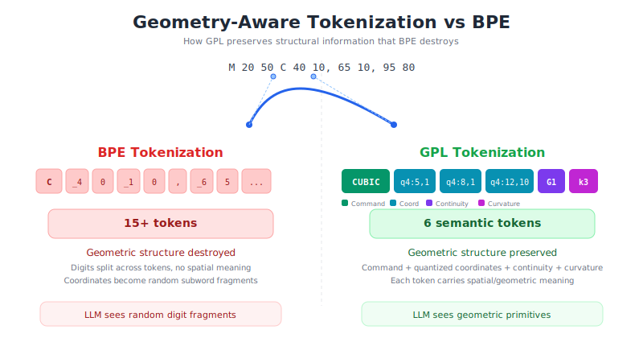
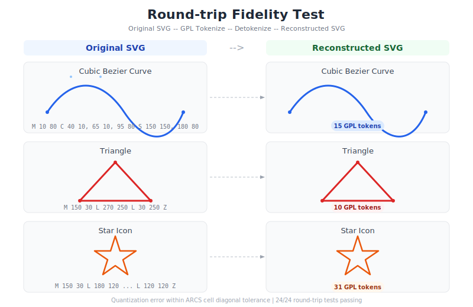
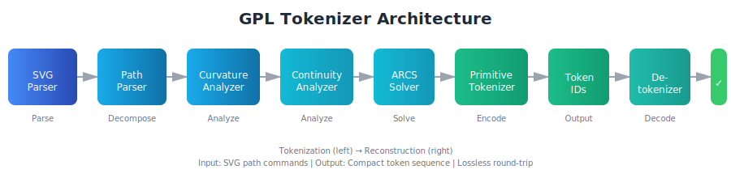
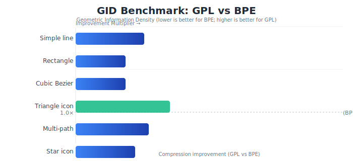
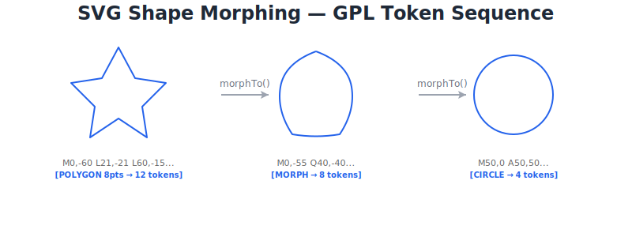
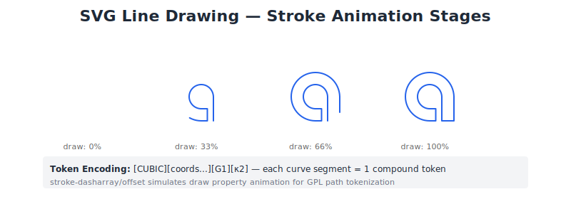
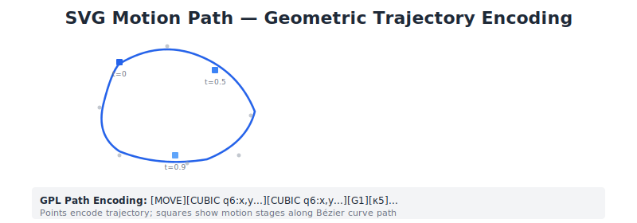

# GPL Tokenizer — Geometric Primitive Language for SVG

<p align="center">
  <strong>A next-generation tokenization system that preserves geometric structure of SVG</strong>
</p>

<p align="center">
  <a href="./README.ko.md">한국어</a> •
  <a href="#features">Features</a> •
  <a href="#quick-start">Quick Start</a> •
  <a href="#architecture">Architecture</a> •
  <a href="#benchmarks">Benchmarks</a> •
  <a href="#roadmap">Roadmap</a>
</p>

---

## Problem

The root cause of **coordinate hallucination** when LLMs generate SVG is that BPE tokenization destroys 2D geometric information.

<p align="center">
  
</p>

```
SVG:    C 40 10, 65 10, 95 80
BPE:    ["C", " 4", "0", " 1", "0", ",", " 6", "5", ...]  → 15+ tokens (geometry destroyed)
GPL:    [CUBIC] [q4:5,1] [q4:8,1] [q4:12,10] [G1] [κ3]    → 6 tokens (geometry preserved)
```

## Features

- **SVG 1.1 Full Parser** — Supports path, circle, rect, ellipse, line, polygon, polyline
- **Geometric Analyzer** — Bézier curvature, G0/G1/G2 continuity, arc length, tangent angle analysis
- **ARCS (Adaptive Resolution Coordinate System)** — Quadtree-based adaptive coordinate quantization
- **Level 1 Primitive Tokenizer** — [Command][Coords][Continuity][Curvature] compound token structure
- **Detokenizer** — GPL tokens → valid SVG reconstruction
- **Round-trip verified** — 24/24 tests passing

## Round-trip Demo

Visual comparison of original vs. reconstructed SVG after GPL tokenization and detokenization:

<p align="center">
  
</p>

## Quick Start

```python
from gpl_tokenizer.parser import SVGParser
from gpl_tokenizer.tokenizer import PrimitiveTokenizer, Detokenizer

# 1. Parse SVG
parser = SVGParser()
doc = parser.parse_string('<svg width="300" height="300"><path d="M 10 80 C 40 10, 65 10, 95 80"/></svg>')

# 2. GPL Tokenize
tokenizer = PrimitiveTokenizer(canvas_size=300, max_coord_level=6)
result = tokenizer.tokenize(doc.elements[0].commands)

print(f"Commands: {result.n_commands}")   # 2
print(f"Tokens: {result.n_tokens}")       # ~8
print(f"Token IDs: {result.token_ids}")

# 3. Detokenize (reconstruct)
detok = Detokenizer(tokenizer.vocab, tokenizer.arcs)
svg_d = detok.detokenize(result.token_ids)
print(f"Recovered: {svg_d}")

# 4. Reconstruct full SVG document
svg_doc = detok.to_svg_document(result.token_ids, width=300, height=300)
```

## Architecture

<p align="center">
  
</p>

```
SVG Text
  → SVGParser (XML → structured elements)
  → PathParser (d attribute → PathCommands)
  → CurvatureAnalyzer (κ, θ, arc length per segment)
  → ContinuityAnalyzer (G0/G1/G2 at junctions)
  → ARCS (adaptive quadtree coordinate quantization)
  → PrimitiveTokenizer (commands + coords + diff attrs → token IDs)
  → [LLM Training / Inference]
  → Detokenizer (token IDs → valid SVG)
```

### Token Structure

Each renderable segment is converted into a token subsequence with the following structure:

| Field | Description | Example |
|:---|:---|:---|
| `CommandToken` | Command type | `CUBIC`, `LINE`, `ARC` |
| `CoordTokens` | ARCS quantized coordinates | `q4:5,1`, `q4:8,1`, `q4:12,10` |
| `ContinuityToken` | Continuity with previous segment | `G0`, `G1`, `G2` |
| `CurvatureToken` | Quantized curvature class | `κ0`(straight) ~ `κ15`(sharp curve) |

### Vocabulary Layout

| Range | Type | Count |
|:---|:---|:---|
| 0-4 | Special (PAD, BOS, EOS, SEP, UNK) | 5 |
| 10-17 | Commands (MOVE ~ CLOSE) | 8 |
| 30-33 | Continuity (DISC, G0, G1, G2) | 4 |
| 40-55 | Curvature bins | 16 |
| 100+ | ARCS coordinates | 5,461 |
| **Total** | | **5,561** |

## Benchmarks

GID (Geometric Information Density) — compared to BPE:

<p align="center">
  
</p>

| SVG Type | GPL Tokens | GID vs BPE |
|:---|:---|:---|
| Simple line | 6 | **2.7×** |
| Rectangle | 13 | **1.6×** |
| Cubic Bezier | 15 | **1.6×** |
| Triangle icon | 10 | **3.4×** |
| Multi-path | 19 | **2.8×** |

## Real-world SVG Examples

GPL tokenization applied to real-world SVG animation patterns (inspired by anime.js):

### Shape Morphing

<p align="center">
  
</p>

### Line Drawing (Stroke Animation)

<p align="center">
  
</p>

### Motion Path (Trajectory Encoding)

<p align="center">
  
</p>

## Project Structure

```
gpl_tokenizer/
├── parser/
│   ├── svg_parser.py          # SVG XML → structured elements
│   └── path_parser.py         # path d → PathCommands
├── analyzer/
│   ├── curvature.py           # Bézier curvature analysis
│   └── continuity.py          # G0/G1/G2 continuity detection
├── tokenizer/
│   ├── arcs.py                # Adaptive Resolution Coordinate System
│   ├── vocabulary.py          # Token vocabulary management
│   ├── primitive_tokenizer.py # Level 1 tokenization
│   └── detokenizer.py         # GPL → SVG reconstruction
├── utils/
│   └── math_utils.py          # Bézier math utilities
└── tests/
    └── test_roundtrip.py      # Round-trip & GID tests (24/24 pass)
```

## Roadmap

- [x] **v0.1** — Core tokenizer (parser, analyzer, ARCS, tokenizer, detokenizer)
- [x] **v0.2** — Level 2 segment merging (circle/rect → single token)
- [ ] **v0.3** — Spatial relation tokens (ALIGN, SYM, PROP)
- [ ] **v0.4** — PyTorch embedding layer with HMN initialization
- [ ] **v0.5** — LLM fine-tuning pipeline (Qwen2.5-1.5B)
- [ ] **v1.0** — API server + Figma plugin

## Key References

1. **HiVG** (Xing et al., 2026) — Hierarchical SVG Tokenization
2. **StrokeNUWA** (Tang et al., 2024) — Stroke tokenization for VG synthesis
3. **LLM4SVG** (Xing et al., 2025) — Empowering LLMs for SVG
4. **VectorGym** (Rodriguez et al., 2026) — SVG multitask benchmark

## License

This project is proprietary. All rights reserved.

---

*Built with the goal of enabling LLMs to truly understand 2D geometry.*
